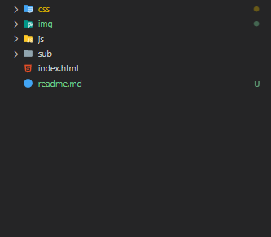

# 🌐 Kinfa Clone Coding

순수 자바스크립트만으로 제작한 서민진흥금융원 홈페이지입니다.
 
 

## 🖥️ 프로젝트 소개

웹프로그래밍을 학습한 후 처음으로 제작한 프로젝트로서,  
어떠한 라이브러리 도움 없이 순수 자바스크립트만으로 웹페이지를 제작했습니다. 

 

 

 

## 🕰️ 개발 기간

-   23.06.07 - 23.06.20 (14일)
 

## ⚙️ 개발 환경

-   `HTML5`
-   `CSS3`
-   `JavaScript (ECMAScript 2022)`
-   `IDE : VScode 1.80`
-   `ETC : Github / Mac Os 환경에서 개발`
-   `DEPLOY : Github.io`
 

## 📁 파일 / 폴더 구조

#### 📂 CSS
- 메인, 서브 페이지에 대한 CSS 파일을 모아둔 폴더입니다.
#### 📂 IMG
- 메인, 서브 페이지의 이미지 소스를 모아둔 폴더입니다.
#### 📂 JS
- 모든 페이지에 대한 JS 파일을 담아둔 폴더입니다.
#### 📂SUB
- 서브 페이지에 대한 HTML 파일을 모아둔 폴더입니다.
#### 📂 INDEX.HTML
- 메인 페이지에 대한 HTML 파일입니다.
 

## 💻 Release History
* 0.0.1 (23.06.20)
    * first release
 

## 📌 주요 기능

#### 헤더 메뉴바

-   같은 2depth의 li가 hover 됐을 때만 display: block이 되고,
-   다른 2depth의 li가 hover 됐을 때는 기존의 li는 display: none이 되어 
-   같은 주제의 메뉴에 집중할 수 있게 제작

#### 메인 배너 슬라이더

-   배너의 index에 대한 display: none/block이 되게 제작
-   해당 배너가 block되면 css transform 속성을 넣어 생동감 있는 배너 제작

#### 서브 배너 슬라이더

-   배너의 position을 변화시켜는 원리로 제작
-   변수를 다르게 하여 js문의 재사용성 높임

#### 탭 메뉴

-   display: none/block 기능을 통해 클릭한 탭의 index에 대한 내용만 보임.

#### 애니메이션 기능

-   key frame 기능을 통해 애니메이션을 주고,
-   delay 시간을 주어 애니메이션에 효과를 더함.

